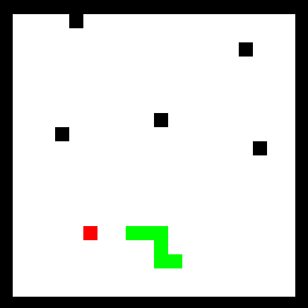

# Snake in Matlab
This repository contains a classic Snake game implemented in MATLAB. The Snake game is a popular arcade game where the player controls a snake that grows in length as it eats food, while avoiding collisions with obstacles and itself. The game was developed as a fun project to demonstrate graphical capabilities and basic game logic using MATLAB.


## Description
### Features
* Simple and intuitive controls: Use the arrow keys to navigate the snake.
* Dynamic gameplay: The snake grows longer each time it eats food.
* Obstacles: An obstacle is generated every time the snake grows for more challenging gameplay
* Random Generation: Food and obstacles are randomly generated
* Collision detection: The game ends if the snake runs into obstacles or itself.
* Score tracking: Keeps track of the player’s score based on the number of food items consumed.
* Customizable settings: Modify game parameters such as snake speed and grid size via the terminal
### Controls
* Arrow keys: Control the direction of the snake
  * Up Arrow: Move up
  * Down Arrow: Move down
  * Left Arrow: Move left
  * Right Arrow: Move right
## Download Instructions
### Prerequisites
MATLAB (R2023b or later)

Download Link: [1]: <https://au.mathworks.com/help/install/ug/install-products-with-internet-connection.html>
### Installation
There are 2 methods to download the project
#### Clone the Repository
1. Open your terminal or command prompt.
2. Run the following command to clone the repository:
   ````
   git clone https://github.com/Woodentree808/snake_MATLAB.git
   ````
3. Navigate to the cloned directory:
   ````
   cd snake_MATLAB
   ````
#### Download as ZIP
1. Go to [1]: <https://github.com/Woodentree808/snake_MATLAB>
2. Click the green "Code" button.
3. Select "Download ZIP".
4. Extract the downloaded ZIP file to your desired location.
5. Navigate to the extracted directory.
### Running the Game
1. Open MATLAB.
2. Navigate to the directory where you cloned or extracted the repository
   ````
   cd path/to/snake_MATLAB
   ````
4. Run the main.m script to start the game
   ````
   run('snake.m')
   ````
## Future Updates
* Add more options to the customisation of the game board dimensions and speed
* Add more features to the game like the obstacles (include a toggle for features), such as:
  *  Teleporting
  *  Inverted Controls
  *  Amount of Food Displayed
* Display Score and High Score while playing the game, not just after
### Contributing
Contributions are welcome! If you have any improvements or bug fixes, please submit a pull request or open an issue.
1. Fork the repository
2. Create your feature branch
   ````
   git checkout -b feature/AmazingFeature)
   ````
4. Commit your changes
   ````
   git commit -m 'Add some AmazingFeature'
   ````
6. Push to the branch
   ````
   git push origin feature/AmazingFeature
   ````
8. Open a pull request
## License
This project is licensed under the MIT License - see the [LICENSE](https://github.com/Woodentree808/snake_MATLAB/blob/main/LICENSE) file for details.
## Acknowledgments
* Thanks to the MATLAB community for providing helpful resources and support.
* Inspired by the classic Snake game available on many early mobile phones and computers.
